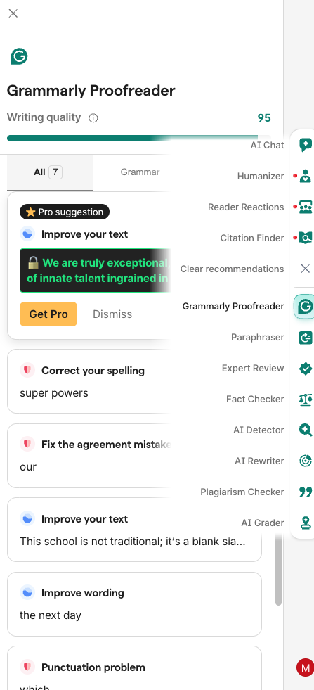

# Grammarly-Revealer

A Chrome Extension Proof of Concept (PoC) demonstrating client-side data leakage in freemium text editing applications.

<div align="center">
  
</div>
## ⚠️ Disclaimer

**This software is for educational and research purposes only.**
It is designed to demonstrate a specific security vulnerability known as [Client-Side Enforcement of Server-Side Security](https://cwe.mitre.org/data/definitions/602.html). The author does not condone the bypass of software licensing or terms of service. Use this code responsibly to understand web security models.

## 🔍 How It Works

Many web applications use "Security by Obscurity" to hide premium content. Instead of withholding the data on the server, they send the full data to the client (your browser) and rely on CSS blurring and simple ciphers to hide it from the user.

This extension demonstrates why this approach is insecure:

1. **MutationObserver:** Monitors the DOM for specific class names associated with premium suggestions.
2. **Shadow DOM Piercing:** Traversing through `shadowRoot` elements to locate obscured content within iframes.
3. **Cipher Breaking:** The application uses a simple Caesar Cipher (Shift -11) to obfuscate the text. This tool reverses that shift locally.
4. **DOM Injection:** Replaces the obscured HTML elements with the decrypted plaintext in real-time.

## 🛠 Installation

This extension is not available on the Chrome Web Store. It must be installed in **Developer Mode**.

1. Clone or download this repository.
2. Open Chrome and navigate to `chrome://extensions`.
3. Toggle **Developer mode** in the top right corner.
4. Click **Load unpacked**.
5. Select the folder containing `manifest.json`.

## 💻 Usage

1. Navigate to a supported text editor (e.g., Grammarly Editor, Coda).
2. The extension runs automatically in the background.
3. When a "premium" suggestion popup appears (marked by a red/blue underline), the extension detects the obscured element.
4. The blurred text is instantly decrypted and revealed in a green box.

## 📝 Technical Details

* **Manifest Version:** V3
* **Permissions:** `activeTab`, `scripting`
* **Key Logic:**
```javascript
// The obfuscation uses a simple character shift
const decrypt = (str) => {
    return str.replace(/[a-zA-Z]/g, c => {
        const base = c <= 'Z' ? 65 : 97;
        return String.fromCharCode(((c.charCodeAt(0) - base - 11 + 26) % 26) + base);
    });
};

```


## 📄 License

Distributed under the MIT License. See `LICENSE` for more information.